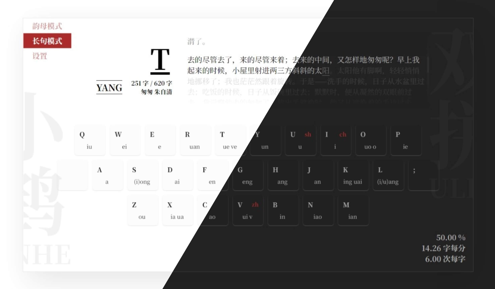
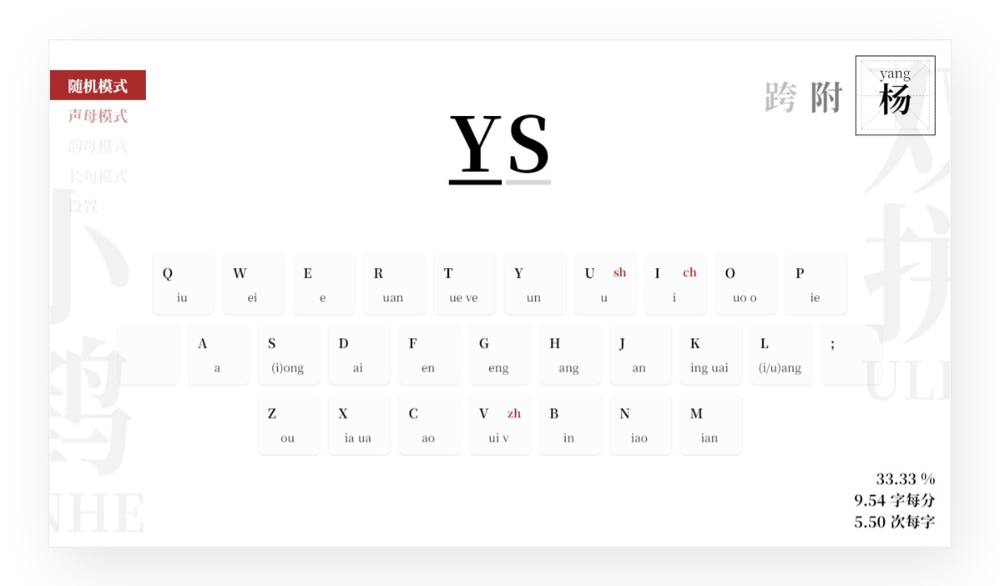
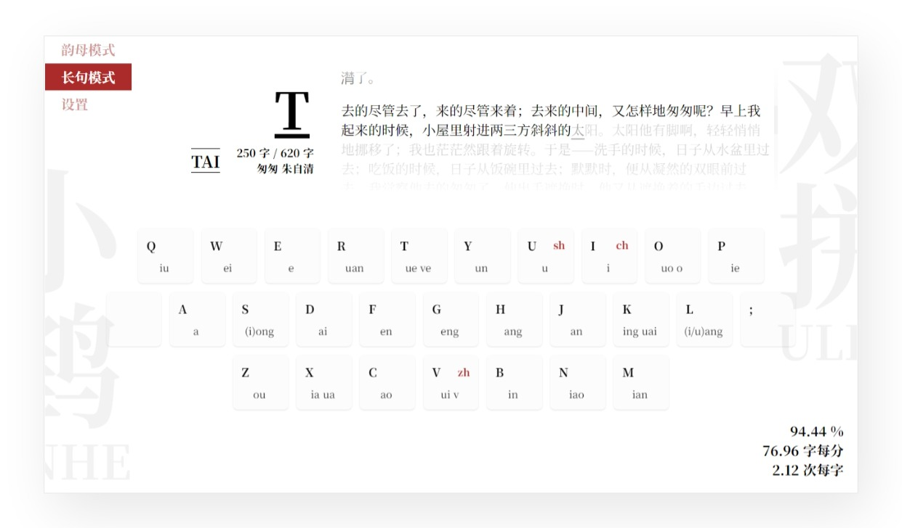
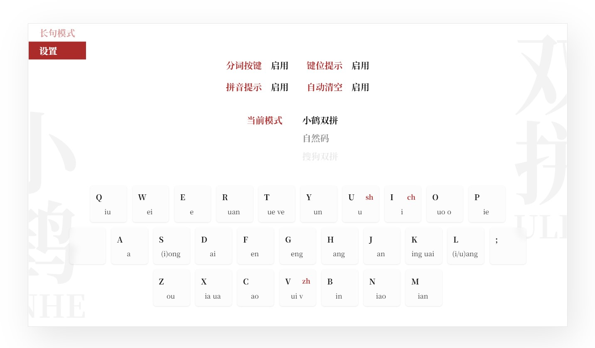

<h1 align="center">纸砚</h1>

可能是最好用的双拼练习工具。

[开始使用](https://blog.simplenaive.cn/shuangpin) / [反馈问题](https://github.com/yidadaa/shuangpin/issues)

## 主要功能
- 多种模式：随机模式、声母模式、韵母模式、长句模式
- 支持自定义双拼模式 [WIP]
- 自定义输入文章
- 一目了然的进度统计
- 持续激励的成就系统 [WIP]

## 已知问题
- https://github.com/Yidadaa/shuangpin/issues/1 多音字匹配不准确，会导致长文模式下的输入体验较差。

## 截图

随机模式

长句模式

设置

## 常见问题
### 为什么多音字的识别不准确？
为了控制页面体积，汉字转拼音的实现是通过静态查表的方式来实现的，并没有对多音字进行区分，所以会出现识别不准的情况，常见的文字有：动词后的“地”被识别为“di”，“长远”的“长”被识别为“zhang” 等等。

## 说明
- 本项目灵感来源自：[双拼练习](https://github.com/BlueSky-07/Shuang)，感谢作者 [@BlueSky-07](https://github.com/BlueSky-07) 制作的工具帮助我入门双拼。
