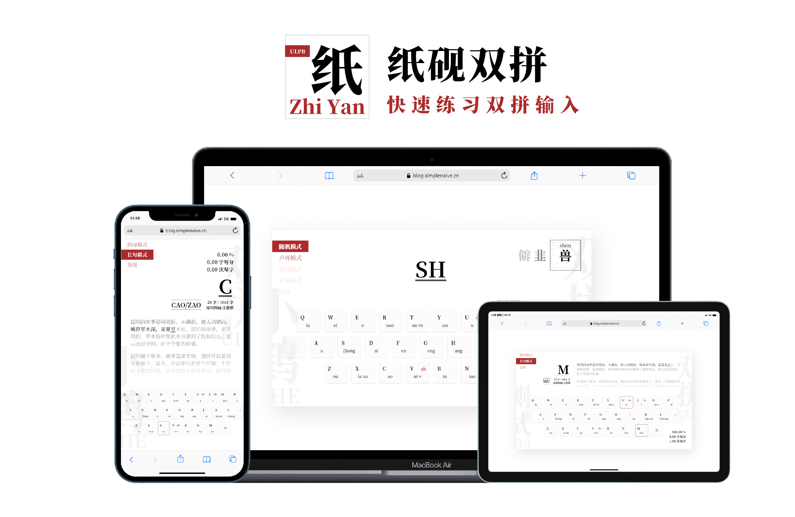
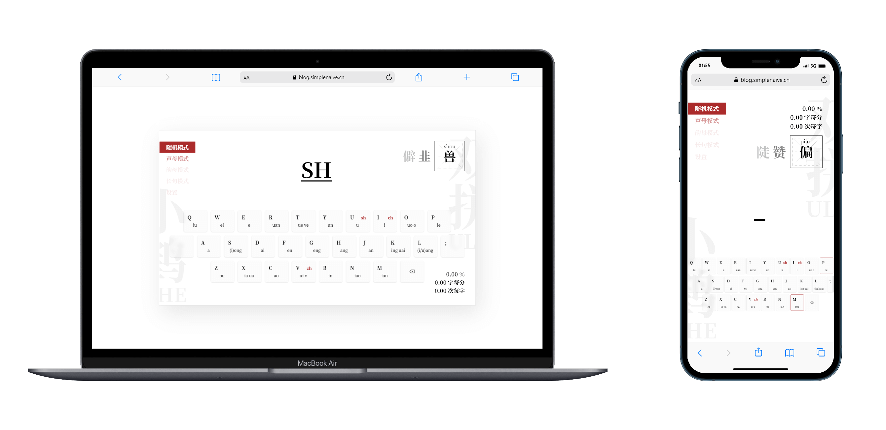
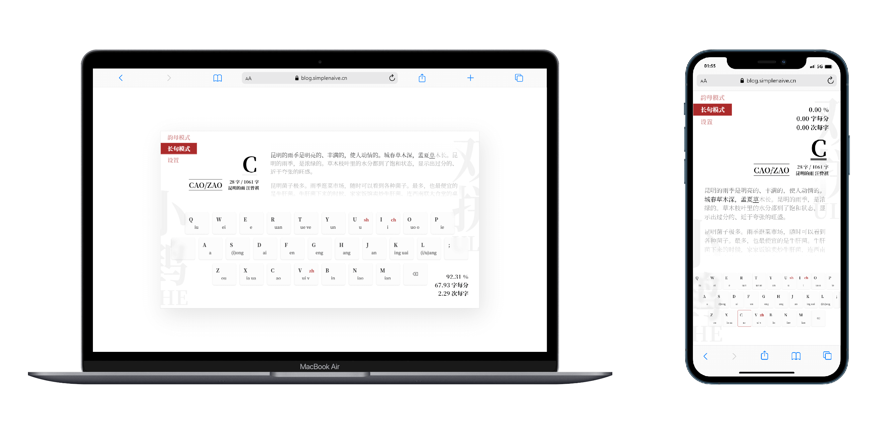

<div align="center">


<h1 align="center">纸砚</h1>

可能是最好用的双拼练习工具，帮助你快速掌握双拼输入法。

[开始使用](https://shuangpin.simplenaive.cn) / [反馈问题](https://github.com/yidadaa/shuangpin/issues)

</div>


## 主要功能
- 多种练习模式：随机模式、声母模式、韵母模式、长句模式
- 多种预置双拼输入模式，支持自定义双拼模式
- 自定义输入文章
- 一目了然的进度统计
- 持续激励的成就系统 [WIP]

## 截图

<div align="center">随机模式</div>



<div align="center">韵母模式</div>


<div align="center">长句模式</div>




<div align="center">设置</div>


## 常见问题
### 如何贡献一个新的双拼方案？
直接编辑这个[文件](./src/utils/spconfig.json)，仿照已有的配置格式新增即可，编辑完毕后发起 Pull Request，请在 Pull Request 中说明方案来源。

配置文件格式：
```json
{
  "双拼名称": {
    "keyMap": { // 按键配置
      "q/iu/q", // 键盘按键/韵母/声母
      ...
      "t/ue,ve/t", // 如果有多个韵母，请使用英文逗号隔开
      ...
    },
    "zeroMap": { // 零声母配置
      "aa/a", // 双拼/拼音
      ...
    }
  }
}
```

如果只是想练习自己的自定义方案，请直接在设置 -> 当前模式 -> 新增双拼中，增加本地自定义方案。

### 为什么多音字展示不全？
当某些文字的多音字列表过长时，会进行截断处理，此时虽然提示列表中没有展示，但是依然可以正常判定。

### 为什么自定义双拼模式下，某些拼音无法识别？
请检查自定义方案是否出现了一对多的双拼映射关系，比如单个双拼输入对应到了多个可能的拼音，这样会导致双拼输入的重码率上升，所以并未对此类方案做兼容。

## 说明
- 本项目灵感来源自：[双拼练习](https://github.com/BlueSky-07/Shuang)，感谢作者 [@BlueSky-07](https://github.com/BlueSky-07) 制作的工具帮助我入门双拼；
- 如果本项目帮到了你，请将节省的时间用于享受生活，善待自己。

## LICENSE
- 本项目使用 [MIT License](https://en.wikipedia.org/wiki/MIT_License) 开源协议；
- 本项目使用 [Anti 996 License](https://github.com/kattgu7/Anti-996-License/blob/master/LICENSE_CN_EN) 作为补充开源协议。
